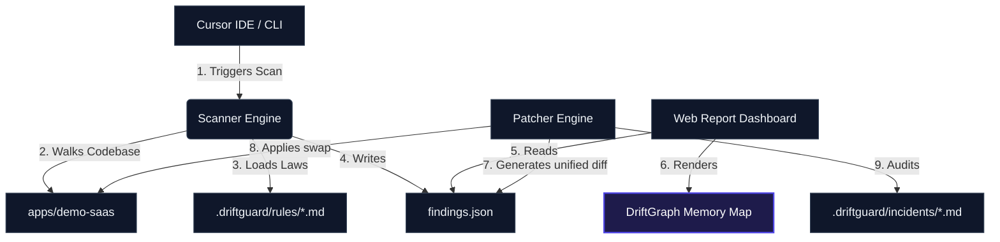

# DriftGuard

> Cursor helps engineers ship faster. DriftGuard helps teams keep their design system consistent while they ship faster.

## What is DriftGuard?

DriftGuard is a Cursor-native design-system drift auditor and auto-patcher. It scans a React/Next.js codebase, detects design-system drift against local markdown rules and token definitions, classifies the intent, explains why the issue matters using LLM-ready reasoning guides, generates unified git-style visual patches, applies the fixes directly in place, and writes persistent markdown memory incidents onto an interactive visual dependency map.

## Why Cursor Needs It

While AI-assisted coding tools like Cursor enable developers to ship layouts at lightspeed, they frequently bypass localized styles and design tokens: introducing hardcoded hex colors, arbitrary Tailwind spacing overrides, custom corner rounding, un-styled native elements, and raw DB query access inside views. DriftGuard catches and reconciles this drift before it pollutes your repository.

---

## Architecture Diagram



---

## Setup & Running Locally

Ensure Node.js and npm are installed.

1. **Install Dependencies**:
   Install monorepo dependencies and link packages using npm workspaces:
   ```bash
   npm install
   ```

2. **Build the Engine Packages**:
   Compile the scanner and patcher CLI engines:
   ```bash
   npm run build:packages
   ```

3. **Launch the Demo Applications**:
   Start both the Next.js SaaS Billing Dashboard (Port 3000) and the Web Report UI (Port 3001) simultaneously:
   ```bash
   # In terminal panel 1
   npm run dev:demo
   
   # In terminal panel 2
   npm run dev:web
   ```

4. **Verify the Demo**:
   - Go to `http://localhost:3000/billing` to view the premium dashboard.
   - Go to `http://localhost:3001` to use the DriftGuard Auditor Report and run the automated patch/fix workflow!

---

## CLI Commands

You can run the underlying deterministic CLI engines directly from the workspace root:

```bash
# Analyze code against .driftguard/rules and generate findings (real line/column occurrences)
npm run driftguard:scan

# Compute token-aligned unified git diffs for all auto-fixable findings
npm run driftguard:patch

# Apply the fixes in-place (pre-fix snapshots are stored in .driftguard/backups)
npm run driftguard:fix

# Restore the pre-fix snapshots to reintroduce the drift (demo reset)
npm run driftguard:reset
```

## How the Engine Works

- **Rules are data**: every markdown file in `.driftguard/rules` declares a `detector` in its frontmatter (e.g. `arbitrary-hex-color`), plus `target_paths` / `exempt_paths` globs and a severity. The scanner only runs detectors that a rule activates.
- **Findings are computed**: each finding carries the exact line/column occurrences from the source, the matched text, and a token-aligned suggestion derived from `tokens.json` (nearest color by RGB distance, spacing snapped to the 4px grid, radius/font sizes matched to the closest scale step).
- **Patches are real diffs**: the patcher recomputes fixed file contents and produces unified diffs with the `diff` library — nothing is hardcoded.
- **Fixes are reversible**: `driftguard:fix` snapshots each file before modifying it, and `driftguard:reset` restores those snapshots.
- **Configurable**: paths (target app, rules dir, tokens file, findings output) live in `driftguard.config.json` at the repo root.

## Future Roadmap

- **Pre-Commit and IDE Save-Hooks**: Lightweight automated background daemon running on-save to alert developers.
- **Figma API Synchronization**: Sync token scale assets directly from design system sheets to codebase `tokens.json`.
- **Expanded Guardrails**: Apply same markdown rules-based parsing engines to enforce backend validation, route permissions, and database abstractions.
